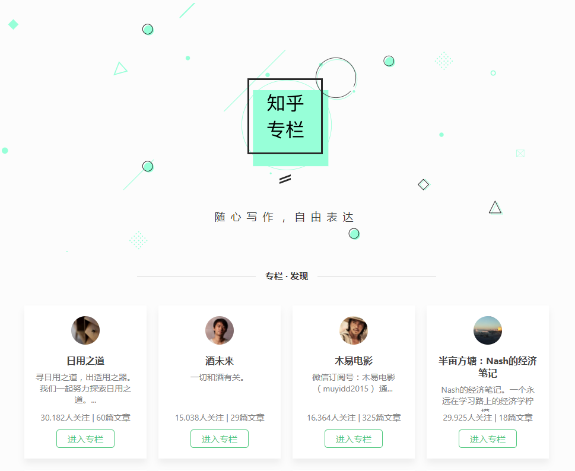

## React 服务端渲染（SSR）最佳实践
React 服务端渲染（SSR）最佳实践 - 仿知乎专栏的 React SSR 应用。

**不同的分支，使用了不同的框架：**
- `master`：react + styled-components + next + koa
- `redux`：react + styled-components + redux + next + koa
- `easy-action`：react + styled-components + redux + redux-easy-action + next + koa
- `after`: react + styled-components + redux + redux-easy-action + after(razzle) + koa

**要点：**
- 使用 Next，Koa 提供后端服务。
- 结合了 React 16、styled-components 的服务端渲染应用。



### 使用
启动服务后，打开 http://127.0.0.1:3000 后，切换路由并查看源码，体验 SSR 效果。。


```bash
git clone https://github.com/Lizhooh/react-ssr-zhuanlan.git

npm install
# or
yarn

npm start # http://127.0.0.1:3000
```
